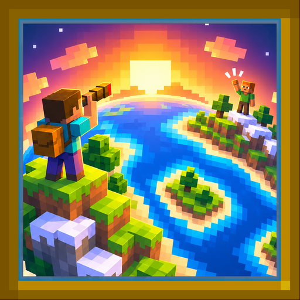

<p align="center"></p>

# Living Horizon

Gives life to the distance. Players and mobs stay visible far past your render distance,
through several rendering techniques, and birds bring the sky to life. It works with the
game alone, at any render distance, and supports far-terrain mods such as Voxy and
Distant Horizons.

A client-side mod for Fabric, Quilt, NeoForge and Forge, on Minecraft **1.20 to 1.21.11**
and **26.1 to 26.3**. Nothing is sent to the server: on its own, the mod uses only what a
vanilla client already receives. With the companion **data pack** on the server (not a
mod: a folder in `world/datapacks`), every position is exact at any distance.

## Install

One jar per game version and loader, named
`livinghorizon-<version>+mc<game version>-<loader>.jar` (no loader suffix for Fabric): drop it
into `.minecraft/mods/`. For exact positions, also drop the data pack zip of the same game
version into the world's `datapacks/` folder (see *The data pack* below).

- **Fabric**: [Fabric Loader](https://fabricmc.net/use/) 0.15.11 or newer and the
  [Fabric API](https://modrinth.com/mod/fabric-api).
  [Mod Menu](https://modrinth.com/mod/modmenu) is optional and adds the settings button.
- **Quilt**: Quilt Loader with the Fabric API (QFAPI).
- **NeoForge** (1.20.6 and later) and **Forge**: nothing else; the mod list's *Config*
  button opens the settings.

[Voxy](https://modrinth.com/mod/voxy) and
[Distant Horizons](https://modrinth.com/mod/distanthorizons) are optional. The mod works
with the game alone, at whatever render distance you like, and on top of either of them if
you use one: it finds it by itself. Distant Horizons works from 2.3 on.

| Minecraft | Java | Fabric, Quilt | NeoForge | Forge |
|---|---|---|---|---|
| 1.20, 1.20.1 | 17 | ✓ | | 1.20.1 |
| 1.20.2 | 17 | ✓ | | ✓ |
| 1.20.3, 1.20.4 | 17 | ✓ | | 1.20.4 |
| 1.20.5, 1.20.6 | 21 | ✓ | 1.20.6 | 1.20.6 |
| 1.21, 1.21.1 | 21 | ✓ | 1.21.1 | 1.21.1 |
| 1.21.2, 1.21.3 | 21 | ✓ | 1.21.3 | 1.21.3 |
| 1.21.4 | 21 | ✓ | ✓ | ✓ |
| 1.21.5 | 21 | ✓ | ✓ | ✓ |
| 1.21.6 to 1.21.8 | 21 | ✓ | 1.21.8 | 1.21.8 |
| 1.21.9, 1.21.10 | 21 | ✓ | 1.21.10 | 1.21.10 |
| 1.21.11 | 21 | ✓ | ✓ | ✓ |
| 26.1 to 26.1.2 | 25 | ✓ | ✓ | 26.1.2 |
| 26.2 | 25 | ✓ | ✓ | ✓ |
| 26.3 | 25 | ✓ | ✓ | ✓ |

Jars and the data pack come from the
[releases](https://github.com/MC-Skin-Creator/living-horizon/releases) page. Releases
are cut from the commits merged into `main`; a version below `1.0.0` is marked *beta*.

## Getting started

1. **Keep the default settings.** They are the best balance between what you see and what
   it costs. If you changed things and the game slows down, *Restore defaults* at the
   bottom of the settings puts everything back (your remembered mobs are kept).
2. **Fill the horizon with mobs.** Out of the box, a mob is remembered once you have met
   it. In a single player world you can skip the walk: open the settings (*Living
   Horizon...* on the Options screen, Mod Menu's *Configure*, or `/livinghorizon config`)
   and press *Scan the chunks around*, or type `/livinghorizon scan` (or
   `/livinghorizon scan 64` for a radius of your choice). The mobs found appear on the
   horizon at once. On a server, the scan has nothing to read: the data pack is what
   shares the mobs.
3. **Check what is followed.** `/livinghorizon` lists the players followed and where each
   position comes from, and says whether the data pack is found.

**Units.** The scan radius is in **chunks** (16 blocks each): the default 32 reads the
chunks within 512 blocks of you. Every other distance in the settings is in **blocks**:
*Mob distance* 512 hides the mobs more than 512 blocks away. *Mobs drawn at most* is a
number of mobs, the bird amount a percentage.

> **Careful with the limits.** *Mobs drawn at most* set to *Unlimited* and *Mob distance*
> set to *Unlimited* together, with every kind of mob ticked, can freeze or crash the game
> on a large world. Raise one limit at a time, and go back to *Restore defaults* if
> things get slow.

## Good to know

- **The data pack makes positions exact.** Without it, a far player is placed from the
  locator bar, so:
  - `/gamerule locatorBar false` on the server leaves only the memory of the last position;
  - a player who **sneaks** leaves the locator bar, and their copy freezes where it was;
  - players in another dimension are not followed.
- **With the data pack, everyone's position is public** to whoever reads its scores: say
  so to your players. Anyone in a team of colour `black`, `dark_blue`, `dark_green` or
  `dark_aqua` would see the coordinates in their sidebar (see *The data pack* below).
- **The scan only works in single player**: a server never sends the mobs of chunks far
  from you. On a server, the data pack shares them.

### What older versions leave out

The game itself lacks what these need, so they are left out rather than imitated:

- **Impostors** (and their preview screen) and the **outlines** need the feature
  renderers of 1.21.9: before, distant figures are always drawn as full models.
- The lines of the **F3 screen** need its entry list of 1.21.9; the mod's own debug panel
  works on every version.
- Players past the server's range are placed by the **locator bar**, which came in 1.21.6:
  before, a player out of range stays where it was last seen (or where the data pack says).
- Mob kinds a version does not have yet (happy ghast, pale oak boats, armadillo, mannequin)
  are not in its lists. Before 1.21.2 every boat was one entity type: boats are remembered
  by the client but not published by the data pack there.

## What you can do

- **See other players far away.** They keep walking where they are, past the range where
  the server stops sending them, with their skin, cape, elytra and armour, and what they
  ride.
- **Watch the distance live.** Animals, villagers and golems graze and wander around the
  far-off villages, and are hidden by the terrain pixel by pixel, shaders included.
- **Look up.** Flocks, geese in a V, gulls on the coast, bats at night - and, now and
  then, a flying saucer taking a cow (`/livinghorizon ufo`).
- **Find players where they left.** Someone who logged off stays asleep where they were,
  until they come back.
- **Tune it.** Everything is in the settings (see *Settings* below): which mobs, which
  birds, how many, how far.

## Settings

- `/livinghorizon` lists the players followed, where their position comes from, and how
  sure it is (`±` blocks).
- A key (unbound by default, under *Living Horizon* in Controls) toggles the copies.
- The settings are in game: the *Living Horizon...* button on the Options screen, Mod Menu's *Configure*, or `/livinghorizon config`. *Restore defaults*, at the bottom, puts every setting back (mob and bird choices included; remembered mobs are kept).
- `config/livinghorizon.json`:

| Setting | Default | Unit | |
|---|---|---|---|
| `enabled` | `true` | | |
| `minApparentPixels` | `0` | pixels | Above 0, a far player is never drawn smaller than this (and stops shrinking) |
| `extendFarPlane` | `true` | | Push the far clipping plane out to the farthest player, so terrain can hide them |
| `lostTimeoutSeconds` | `30` | seconds | How long a copy stays once the locator bar loses them |
| `distantMobs` | `true` | | Keep remembered mobs visible far away |
| `maxDistantMobs` | `512` | mobs | How many of them are drawn at once, nearest first (`1000`: no limit; no limit here and in `mobMaxDistance` together can crash the game) |
| `mobMaxDistance` | `512` | blocks | Past this, distant mobs are not drawn (`0`: no limit) |
| `playerMaxDistance` | `0` | blocks | Past this, distant players are not drawn (`0`: no limit) |
| `mobTypes` | the 31 kinds of the data pack | | Which mobs are shown, and remembered by this client (in game: "Choose mobs...") |
| `stillMobTypes` | happy ghast | | Mobs shown standing still instead of walking their loop (in game: "Still") |
| `rememberNamedMobs` | `true` | | A mob with a name tag is shown whatever its type |
| `scanRadius` | `32` | **chunks** | Chunks around you read by a scan, in single player, from 4 to 1024 (32 chunks = 512 blocks) |
| `skyBirds` | `true` | | Birds and bats around you |
| `birdDensity` | `100` | percent | How many birds, all kinds together (`0`: none, `500`: five times as many) |
| `birdMaxDistance` | `800` | blocks | How far away birds can be |
| `birdMinHeight` | `30` | blocks | Above you (or the sea, whichever is higher), below which flocks never fly |
| `birdSize` | `1` | times | How much bigger than life birds are drawn |
| `ufo` | `true` | | The easter egg |
| `depthOcclusion` | `true` | | The far terrain's depth (Voxy or Distant Horizons) on distant mobs and players, pixel by pixel (see *The far terrain's depth* below). Was `voxyOcclusion`. In *Debug...* |
| `offlinePose` | `"sit"` | | A player who logged off: `"sleep"`, `"sit"` or `"hidden"` |
| `showVehicles` | `true` | | Draw the mount they were last seen on |
| `renderTrackedVehiclesFar` | `true` | | Never cull a mount that carries another player |
| `hideOccludedMobs` | `true` | | Do not draw distant mobs behind terrain at all (see *Mobs hidden by depth* below). In *Debug...*, with `depthOcclusion` |
| `impostors` | `true` | | Draw far players and mobs as a flat picture of themselves (see *Impostors*) |
| `impostorDistance` | `128` | blocks | Past this distance an impostor stands in for the model |

### Debugging

*Debug...* at the bottom of the settings, or `/livinghorizon debug` (panel and boxes):

- **Panel** (top left; in the F3 screen, the `living_horizon` option of the game's debug options, F3 + F6,
  which `/livinghorizon debug` turns on too): cost per tick and frame, what became of
  every distant mob in the last frame, far terrain reads and depth, how far this server sends mobs, optimisations on.
- **F3 screen**: a line with the polygons of the mod's own entities - the distant players
  and mobs, never the game's - split into full models and impostors (one quad each), and
  a line of impostor sheets baked and waiting. It is in the F3 + F6 list as `fake_entities`.
- **Boxes**, seen through terrain, coloured by what became of the mob: green copy drawn,
  cyan real mob drawn by the mod, blue player, white real mob drawn by the game (*Also the
  game's mobs*), yellow too small (under about half a pixel), orange behind blocks, red
  outside the view, purple being built, grey past `maxDistantMobs`. A dot in the middle
  keeps them visible when the box is smaller than its lines.
- **Labels**: state, kind, distance and size on screen, at a constant size.
- **Outlines** (*Outlines...*): an outline seen through terrain around each kind of figure,
  each on its own switch, in the colours of the boxes - white the mobs and players the game
  draws (`outlineGameMobs`), cyan the real mobs the mod draws (`outlineLiveMobs`), green the
  3D copies (`outlineCopies`), blue the distant players (`outlinePlayers`), magenta the
  impostors (`outlineImpostors`) - and a cross a few pixels wide where a distant mob is not
  drawn at all, in the colour of why (`outlineLeftOut`): where it is, not what it is. Made
  for screenshots that compare optimisations. Outlines need 1.21.9 (impostor outlines 1.21.9
  to 26.1), crosses 1.21.11.
- **Depth view** (bottom right): the game's depth, with the far terrain merged, or after
  the entities - near white, far black, sky blue.
- Every optimisation has its own switch (`opt*` in the file), to compare the cost.

## How it works

Everything below is for the curious, and for whoever works on the mod.

### The data pack: exact positions

`build/libs/<version>/livinghorizon-datapack-<version>+mc<game version>.zip`, built from the
`datapack/` folder, with the pack format and folder names of that game version. Drop it in the world's `datapacks/` folder and run `/reload`.

Five times a second it writes each player's position, yaw, dimension and whether they
ride something into four scoreboard objectives (`lh.x`, `lh.y`, `lh.z`, `lh.m`). An
objective shown in any display slot is sent by the server to **every** client, at any
distance, so the pack shows its four in the sidebars of four team colours (`black`,
`dark_blue`, `dark_green`, `dark_aqua`): nobody sees them on screen, every client
receives them, and the mod reads them. `/livinghorizon` says whether the pack is found.

- Anyone in a team of one of those colours would see the coordinates in their sidebar.
  If your server uses them, change the four `setdisplay` lines in `load.mcfunction`.
- Any client can read these scores: everyone's position is public to whoever looks.
- `/function livinghorizon:uninstall`, then `/datapack disable "file/<pack name>"`,
  removes everything it created.

`DatapackTest` compiles every function with the game's own command dispatcher, and
parses `pack.mcmeta` and the predicate with the game's own codecs.

### Players who logged off

A player who logs off stays where they were last, asleep on the ground (or sitting, see
`offlinePose`), until they come back. This is remembered per server across sessions, in
`config/livinghorizon/resting/<server>.json`. With the data pack, even players who logged
off before you joined are there: the pack keeps everyone's last position, and their
skin is fetched from Mojang by name.

### Mobs far away

Animals (and villagers, golems, allays, named mobs) stay visible once out of range,
where they were, playing an animation in a loop: a stroll of a few blocks with pauses
to graze or look around, and back. No AI runs anywhere: the animations are written once
(`track/MobAnimations`), the blocks around the mob choose which one it plays, and each
mob starts its loop at its own moment, drawn from its UUID. It is a picture of what
lives there.

- **With the data pack**, every five seconds it publishes every remembered mob loaded
  around any player: position, kind, variant (horse coat, sheep colour, llama, rabbit,
  axolotl, parrot) and age, under the mob's UUID, in the same four objectives. Whoever
  was last near a mob leaves its position for everyone, and the server resets the scores
  of a mob that dies, so it disappears for everyone. Which mobs: the entity type tag
  `tags/entity_type/remembered.json`, numbered in `mob_kind.mcfunction` in the order of
  `MobKinds.TYPES` (`DatapackTest` checks the three agree).
- **Without it**, each client remembers the mobs it met itself
  (the types in `mobTypes`, chosen in game), in `config/livinghorizon/mobs/<server>.json`.
- A mob met up close keeps its exact look (the game's own save of it); one known only
  from the pack is built from kind, variant and age.
- Coming back within range of a remembered mob that is not there forgets it.
- When a mob is remembered, the blocks within 8 blocks of it are read once
  (`track/MobPaths`, from loaded chunks or the far world, Voxy or Distant Horizons): in
  each column, the floor nearest its height with room above it. Grass, flowers, crops and
  snow layers are air to it, a path dug with a shovel is ground; water, leaves, fences and
  walls are not. Voxy gives every block of the column; Distant Horizons only its top one.
  Every animation is laid on that ground, turned eight ways and mirrored, and fits when it
  never leaves the ground nor climbs or drops more than a block at a time - never off a
  cliff, never over a fence. One of the widest that fit is played; with none, it turns on
  the spot. Nothing is computed while it plays but a point of the animation (`track/MobMotion`).
- Head glances come at their own pace; animals graze in the pauses the animation has.
- A copy never jumps. When the pack reports a drawn mob somewhere else, it walks to the
  new spot in a straight line (the ground there is read again meanwhile), then plays the
  animation chosen there.
- Coming up to the distance where the server starts sending a mob (`MobMotion.home`), its
  puppet stops playing and walks back to the spot where it was last seen. When the server
  sends the real mob, the copy walks the rest of the way up to it (faster the farther it
  is) while the real one is kept out of the frame, and the real one takes over once both
  stand in the same place.
- A mob shorter on screen than `animationMinPixels` (10 by default, 0 always animates) plays
  no walking or idle animation: it keeps sliding along its animation and turning, every
  tick, but its legs stay still (`optStillTiny`). It resumes at that size plus a quarter and
  a pixel, so it never flickers. `animationMaxDistance` (blocks, 0 no limit) also stills
  every mob past it, however big (`MobMemory.isStill`).
- With `optFreezeHidden` (debug screen, off by default), a copy that has not been drawn for
  half a second - out of view, hidden, too small - is not ticked at all: no animation, no
  path read, only a position, until it is drawn again.
- A copy is never drawn where the real mob would be sent (`MobMemory.nearRange`: how far the
  server sends that kind - the *Entity Distance* slider in a single player world - within
  the render distance, less 16 blocks, never under 24), except while it walks up to the
  real one: it is not where the real mob is, and could be walked up to. The simulation
  distance does not shrink that zone. With the debug boxes on, it shows as "too close for
  a copy".
- `maxDistantMobs` (512; 1000 is no limit) of them are drawn at once: the nearest.
- The hand-over never leaves a gap. A mob the server still sends but the game does not
  draw (past the *Entity Distance* slider, or in a part of the world it does not draw) is
  drawn by the mod; the moment the server stops sending it, its copy takes its place, on
  the next tick. How far the server sends each kind of mob is learnt from what it sends
  (vanilla: up to the view distance; Paper: 48 blocks for animals): a copy is only judged
  missing well inside that, never just because its chunk is loaded.
- **Scan the chunks around** (a button in the settings, or `/livinghorizon scan [radius]`):
  in a single player world, the mobs of every chunk within `scanRadius` chunks are read
  from the world itself (`track/MobScan`) and remembered at once, no need to walk there.
  Chunks the integrated server has loaded give their mobs as they are; the others are read
  from the save, the way the game reads a chunk's entities, without loading or generating
  it. A remembered mob in the scanned chunks that is not found any more is forgotten. On
  another server there is nothing to read: the server only sends the mobs near you, and
  the data pack is what shares the others.
- Mob types of other mods are shown from the start (monsters excepted). Mannequins are
  too, standing still: Distant Friends uses them as its fake players. The data pack only
  shares vanilla kinds; the others are remembered by each client.

### Birds

Purely a picture, on this client: flocks crossing the sky, geese in a V, birds of prey
circling, gulls over the coast (landing on the beach now and then), pigeons sitting on
tall buildings, robins hopping in fields, tits in the trees, ducks on lakes and rivers,
bats at night (some hanging under leaves and roofs), now and then parrots. Perched birds
fly off when you come close; ducks never let you near. Birds never vanish at once: they
scatter and shrink away. An easter egg: now and then a flying saucer takes a cow
(`/livinghorizon ufo`).

Where each kind goes is read off the terrain a few columns at a time - from the chunks
loaded here, or farther from the far world (`compat/LodWorld`, which reads Voxy through `VoxySource` or
Distant Horizons through `DhSource`, its public API): crops or farmland for
robins, leaves for tits, a man-made block well above its neighbours for pigeons, a beach or
ocean biome for gulls. Birds are small 3D models (`ambient/BirdModels`): boxes in pixels,
like the game's mobs, coloured box by box over a feather grain (`textures/misc/birds_3d.png`);
the wings beat and bend at the tip, perched birds stand on their legs, ducks float. With
`birdStyle` set to `2d` they are pixel sprites from `textures/misc/birds.png` instead (flying:
seen from above, one plane per wing; perched: seen from the side, facing the camera). Bats
and parrots are the game's own either way.

Settings: on/off, how many (`birdDensity`, percent), how far (`birdMaxDistance`), how low
flocks may fly (`birdMinHeight`), size, 3D or 2D (`birdStyle`), and each kind on its own
("Choose birds...", `hiddenBirds`).

### Impostors

On by default (`impostors`). Past `impostorDistance` blocks, a distant player or mob is not
extracted and submitted as a model: a flat picture of it, always turned to the camera, is
drawn instead. A figure 200 blocks away is a handful of pixels tall, so the picture loses
nothing, and the game no longer builds a render state and a model for it every frame.

- **Baked by the game's own renderers.** `render/impostor/ImpostorAtlas` draws each figure
  the way the inventory draws a player (an orthographic picture through the entity's own
  renderer), eight views around it, at twice the size of a tile. Skins, armour, other mods'
  models and the resource packs in use are all followed, because nothing is drawn but by
  the game. The views are read back and written into an atlas page: the game's
  texture-to-texture copy cannot be used, it only copies right at the corner of a texture
  and stretches anything written elsewhere.
- **Mip levels.** `ImpostorPixels` works out each tile's levels on the CPU (64 down to 8
  pixels): colours averaged by how opaque they are, the see-through pixels round a figure
  given its colour so its outline does not turn dark, and an alpha ramp that crosses the
  cut-out shader's 0.1 at half coverage, so a small figure is neither a ghost nor fatter
  than its model. The page samples them smoothly when small, by pixels when large.
- **Light.** Colour only, no normal map: the game's entity shaders have no use for one. The
  pictures are lit by the game's world light as a model is (turned over, the way the
  picture is drawn), and the quad's normal points up, which that light leaves at full
  brightness; only the light where the figure stands (sky, torches, night) is applied on top.
- **When.** Every figure on hand (distant players, remembered mobs) is queued about once a
  second, near or far, and baked a little each frame from the GUI pass (3 ms at most, one
  sheet at least), so they are ready when a figure crosses the distance. A figure whose
  sheet is missing is drawn as a model meanwhile. A resource reload throws every sheet
  away and they are baked again.
- **What counts as the same figure.** `ImpostorKey`: the type, the player's skin, the
  synched data that changes the look (variant, colour, profession, baby, pose; not health,
  air, score or being on fire) and what it wears.
- **No blinking.** A figure becomes an impostor past `impostorDistance` and a model again
  only 5% inside it; it keeps a picture until it has turned 8 degrees past the next one;
  and when its look changes, it keeps its old picture until the new one is baked.
- **Sizes.** Two pages of 128 sheets each; past that the sheet unused for longest is
  replaced.
- **Preview.** *Impostor Manager...* in the settings, or `/livinghorizon impostors`: every figure
  baked, its eight views, and its front view at 32, 16 and 8 screen pixels, as it looks
  far away. *Bake again* throws every picture away and bakes the figures on hand anew,
  even after a failed bake.
- **Not impostors:** figures with a mount or a rider, players resting on the ground, the
  birds and the saucer's cow.

### The far terrain's depth

Distant Horizons draws its terrain into a framebuffer of its own and never writes its depth
into the game's. `compat/DhDepth` reads that depth texture and its projection, and
`FarDepth` converts it to the game's depth the same way (and undoes it after the
entities). Not tried with a shader pack on Distant Horizons.

With a shader pack that keeps Voxy's terrain out of the game's depth buffer (Photon sets
`excludeLodsFromVanillaDepth`), anything drawn past the render distance would show through
Voxy's mountains. `compat/FarDepth` writes Voxy's depth into the game's - with Voxy's own
depth blit - just before the entities are drawn, and puts the original back just after,
except where an entity was drawn. Distant mobs are then hidden by Voxy terrain pixel by
pixel, and the pack still finds the depth it expects. Without a pack, Voxy does this itself.
Under a pack's render scale (Photon's TAAU), the pack draws the world in the bottom left
corner of the depth texture and says so to Voxy (`useViewportDims`): Voxy's depth, the depth
view and the occlusion queries all go in that corner too.

### Mobs hidden by depth

"Skip mobs behind blocks" (`hideOccludedMobs`) does not draw a distant mob the terrain
hides. `compat/OcclusionQueries` asks the GPU, against the depth of the picture, where Voxy's
or Distant Horizons' terrain already is (merged by `FarDepth`):

- just before the entities are drawn, the box around each distant mob is drawn against that
  depth, writing nothing, inside an occlusion query (`GL_ANY_SAMPLES_PASSED_CONSERVATIVE`),
  with the matrices of the frame (`LevelRendererMixin`, `renderLevel`);
- the answers are read a frame or two later, never waited for;
- a mob whose last answer is "no pixel passed" is not drawn, and is asked about again every
  frame, so it comes back as soon as one pixel of it would show.

The GPU projects the box exactly as the mob is drawn, so the answer is the picture's. Depth
clamping keeps a box past the far plane at the far plane: the sky never hides a mob, terrain
in front does. A mob never asked about, or whose answer is more than six frames old, is
drawn. With `optOcclusionQueries` off, or once the queries failed, the mobs are tested in
the far terrain's world instead (`Occlusion`); the two answers are never mixed.

### Where the position comes from, without the data pack

| Distance from you | What the client knows | What is drawn |
|---|---|---|
| Inside the server's view distance | The entity itself | The real player (the mod only stops their mount from being culled) |
| View distance → 332 blocks | The locator bar sends their **chunk** | A copy, kept inside that chunk |
| Past 332 blocks | The locator bar sends a **direction** only | A copy, at an estimated distance |
| No locator bar signal | Nothing | The copy stays where it was, then fades after `lostTimeoutSeconds` |

The locator bar (the bar above the hotbar that shows where other players are) is the
key: the server sends it to every client, with the player's UUID, at any distance.
Past 332 blocks it is only an angle. One angle is a line, not a point - but as you move,
you see that line from somewhere else, and the lines cross. `track/PositionFilter` is a
particle filter that does exactly that. In practice:

- **The direction is always right**, to about half a degree.
- **The distance is found when you move sideways** relative to them: in the tests, a
  minute of walking (340 blocks) across the line of sight places a player 1.7 km away
  to within 25 to 190 blocks.
- **If you both stand still, or they walk straight away from you**, the distance
  cannot be known from a direction alone. The estimate then keeps the last distance it
  had, or follows the speed they were last seen walking at.

The copy is drawn by the game's own renderer, so skins, capes, elytras, armour and
shader packs work. It is drawn where it really is, at its true size, so terrain in front
of it hides it: Voxy writes its terrain into the game's depth buffer and removes the
distance fog. The game's far clipping plane (four times the render distance) is pushed
out to the farthest player when needed (`extendFarPlane`).

#### What breaks it

- `/gamerule locatorBar false` on the server: only the memory of the last position is left.
- A player who **sneaks** disappears from the locator bar (vanilla behaviour), so the copy
  freezes where it was.
- Another dimension: the locator bar only covers your own.
- A player who was **never** close to you is drawn standing, with their skin, and no mount:
  what they ride is only known once the server has sent it.

## Building

```sh
./gradlew :1.21.11:build          # one node: compiles and runs the tests
./gradlew :1.20.1-forge:build     # nodes are <game version>[-quilt|-neoforge|-forge]
./gradlew buildAndCollect         # every jar and data pack zip in build/libs/<version>/
```

Official Mojang mappings on every target, Stonecutter with one node per game version and
loader: the targets are the tables of `stonecutter.properties.toml`.

## License

Living Horizon is source-available under the [Living Horizon License](LICENSE),
copyright 2026 clixmods. The mod, the data pack and the textures are all covered.

- You can read the code, build it, and run the mod alone or in a modpack.
- The official jar can be redistributed, unchanged, in modpacks and on mirrors, as long
  as you credit Living Horizon and clixmods and link to this repository.
- Modified versions, forks and reuse of the code in other projects are not allowed: the
  project is developed in one place, and contributions come here.
- If the project is abandoned (this repository is archived or declared so here), it
  passes to the GPL-3.0 and anyone may carry it on, as a clearly unofficial fork that
  keeps the credits and links back to this repository.

Every contributor is credited, whatever happens to the license or to the project.

Versions published before this license were under the GPL-3.0 and keep it.

## Contributing

Pull requests are welcome, to this repository only. [CONTRIBUTING.md](CONTRIBUTING.md)
explains how, and what you agree to when you open one. Commits are in English, as
conventional commits (`feat:`, `fix:`, ...); `CLAUDE.md` describes the rules this
repository follows.

Minecraft is a trademark of Mojang Studios. This project is not affiliated with or
endorsed by Mojang Studios or Microsoft.
